#  Management.Rework - PFE Project
 
 🚀 **"From Code to Production with Zero-Downtime"**  

## 🎓 Projet de Fin d'Études (PFE) 2025-2026

**Cloud-Native Microservices Platform with SRE-Driven DevOps & Progressive Delivery**

---

## 📋 Overview

**Management.Rework** is a **production-grade microservices platform** built as my final year engineering project, demonstrating **SRE-driven DevOps** practices on Azure.

### 🚀 Key Features

| Feature | Implementation |
|---------|----------------|
| ✅ **Infrastructure as Code** | Terraform + Ansible on Azure (AKS, VNet, MySQL, ACR, Key Vault) |
| ✅ **CI/CD Pipeline** | 5-stage Azure DevOps with AI-powered security gates |
| ✅ **Service Mesh** | Istio with Kiali visualization and traffic management |
| ✅ **AI-Powered Operations** | Ollama + Mistral 7B for intelligent analysis |
| ✅ **Shift-Left Security** | Trivy container scanning + SonarCloud quality gates |
| ✅ **Progressive Delivery** | Canary deployments (10% → 50% → 100%) with auto-rollback |
| ✅ **Full Observability** | Prometheus metrics + Grafana dashboards + Node Exporter |
| ✅ **Zero-Downtime** | Rolling updates and canary deployments |
| ✅ **Auto-Rollback** | Automated regression detection and rollback |

### 🎯 What This Project Demonstrates

| SRE Principle | Implementation |
|---------------|----------------|
| 📊 **Observability** | Prometheus, Grafana, Kiali, Loki |
| 🔄 **Automation** | Fully automated CI/CD with Azure DevOps |
| 🛡️ **Resilience** | Auto-rollback, canary deployments, circuit breakers |
| 📈 **SLIs/SLOs** | Latency, error rates, traffic metrics |
| 🔒 **Security** | Shift-Left scanning, Key Vault, mTLS |
| 🤖 **AI Integration** | Ollama for intelligent analysis and insights |

## 🏗️ Architecture

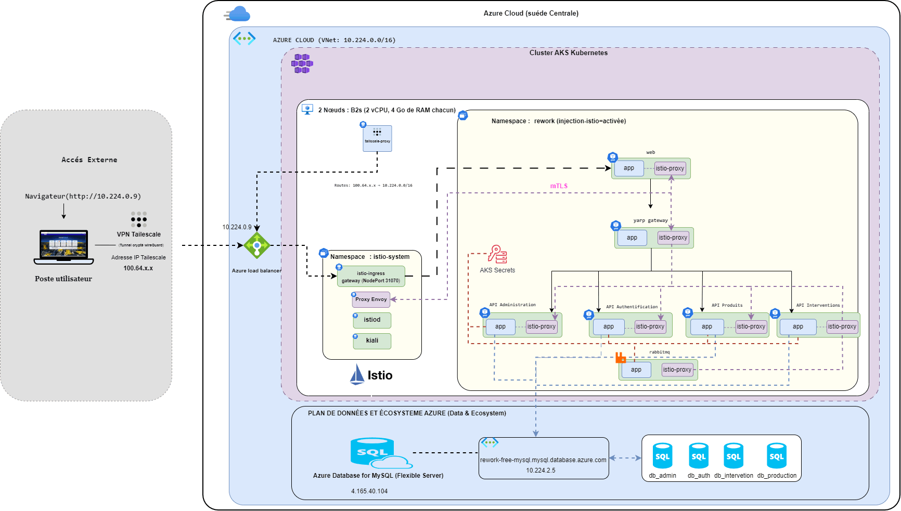

### Microservices

| Service | Description |
|---------|-------------|
| **API Gateway** | Entry point, routing |
| **Admin API** | Administration management |
| **Auth API** | Authentication & Authorization |
| **Products API** | Product management |
| **Intervention API** | Business logic |

---

## 🛠️ Tech Stack

| Category | Technologies |
|----------|--------------|
| **Cloud** | Azure (AKS, ACR, MySQL, Key Vault) |
| **IaC** | Terraform, Ansible |
| **CI/CD** | Azure DevOps + WSL2 Agent |
| **Container** | Docker, Kubernetes |
| **Service Mesh** | Istio, Kiali |
| **Security** | Trivy, SonarCloud |
| **AI** | Ollama, Mistral 7B |
| **Monitoring** | Prometheus, Grafana |

---

## 📸 Screenshots

### AKS Cluster

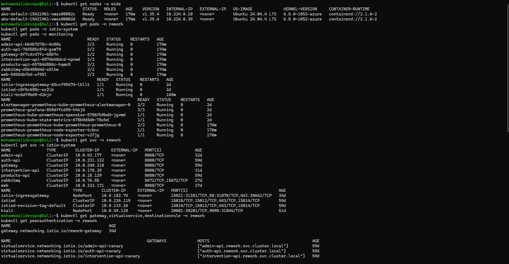

### Kiali Service Mesh Dashboard

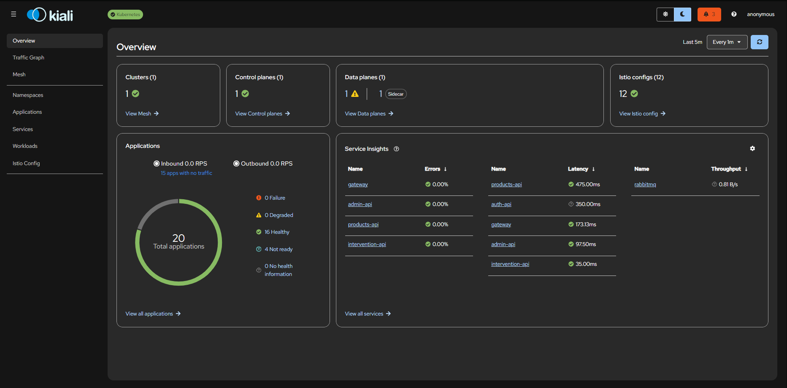

### Kiali Service Graph

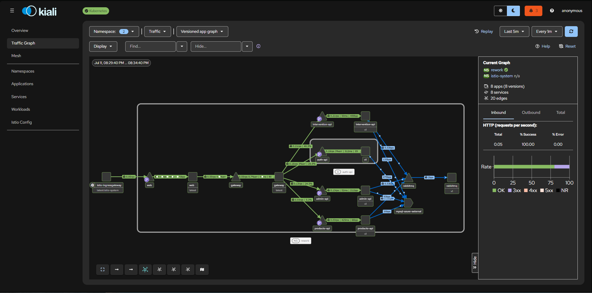

### Istio VirtualServices & DestinationRules

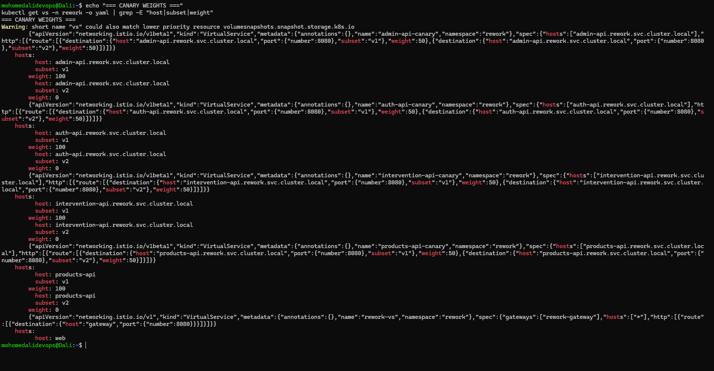

---

## 🔵 Azure DevOps Pipeline

### Pipeline Overview
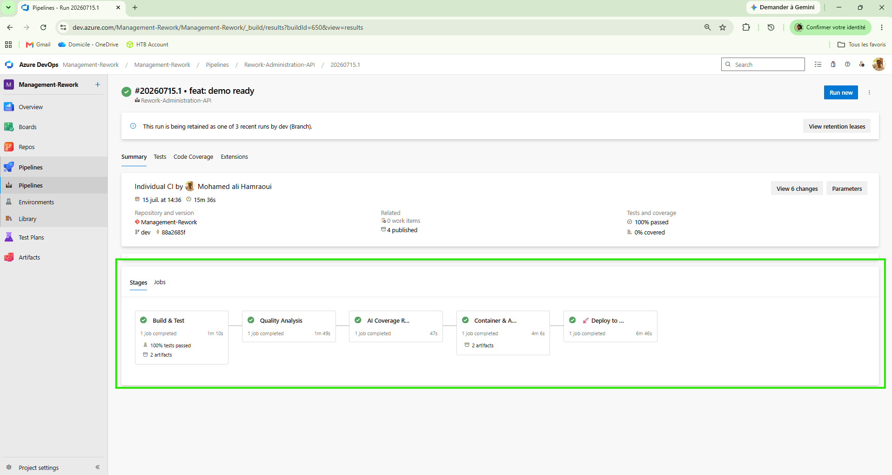

*Complete CI/CD pipeline with 5 automated stages: Build → Quality → AI Coverage → Security → Deploy*

### Stage 1: Build & Test
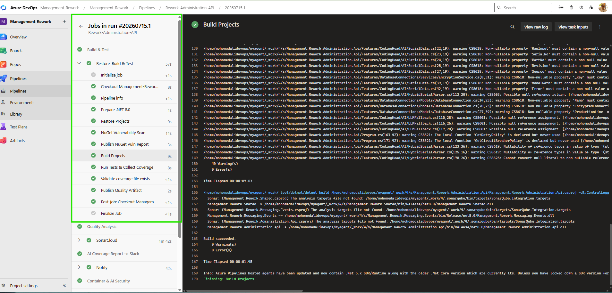

*.NET restore, build, unit tests, and code coverage generation*

### Stage 2: Code Quality (SonarCloud)
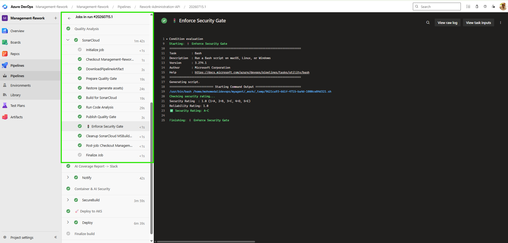

*SonarCloud quality gate with security rating enforcement (A-E)*

### Stage 3: AI Coverage Report → Slack
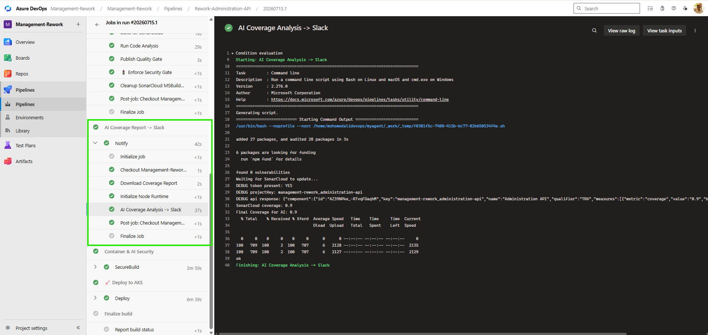

*AI analyzes coverage and sends actionable insights to Slack*

### Stage 4: Container & AI Security
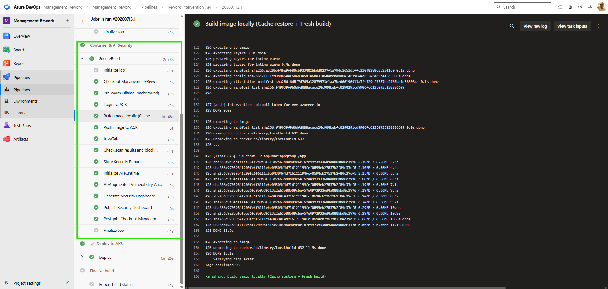

*Trivy vulnerability scan with Ollama AI analysis. Blocks if Critical/High found*

### Stage 5: Deploy to AKS
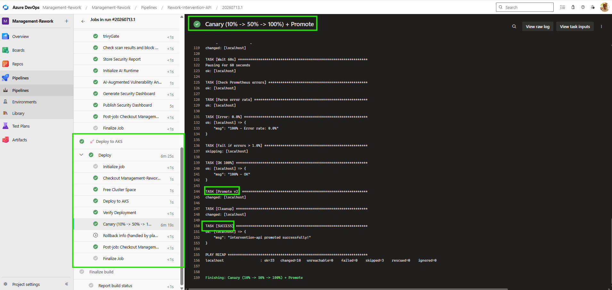

*Canary deployment to Azure Kubernetes Service*

### Canary Rollout
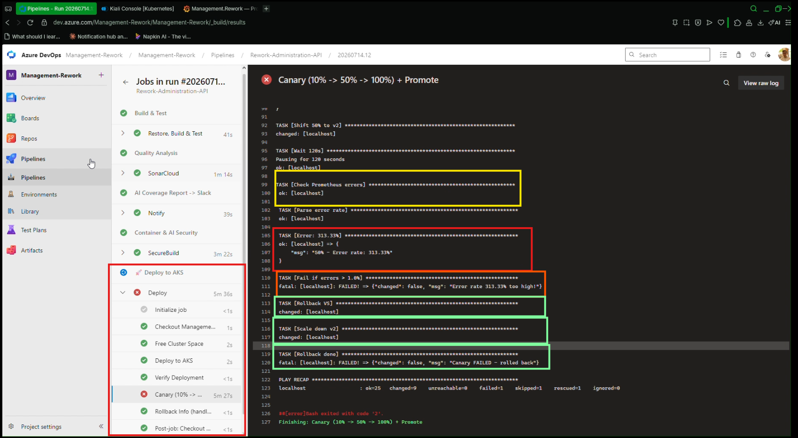

*Progressive canary: 10% → 50% → 100% with auto-rollback*

---

## 📊 Grafana Monitoring

### Node Exporter Dashboard

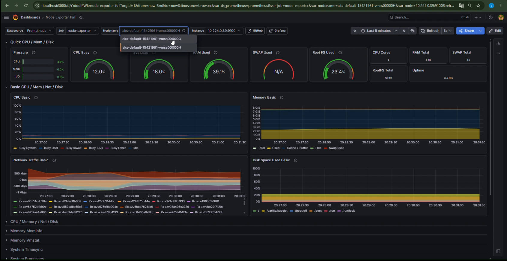

*Figure: Node metrics showing CPU, Memory, Disk, and Network usage*

### Monitoring Stack

- **Prometheus**: Metrics collection
- **Grafana**: Dashboards and visualization
- **Node Exporter**: Node metrics

---

## 🚀 Canary Rollback in Action (Live Capture)

### 📊 Grafana Detection - Rollback Analysis

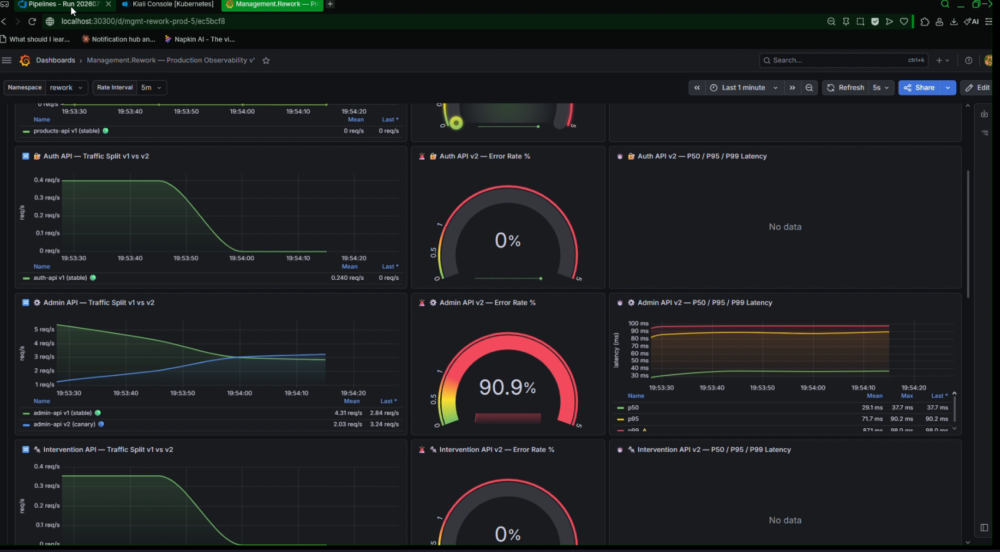

*Figure: admin-api canary rollout automatically detected a regression and rolled back — captured live from the Grafana dashboard.*

---

### 📊 Traffic Split (v1 vs v2)

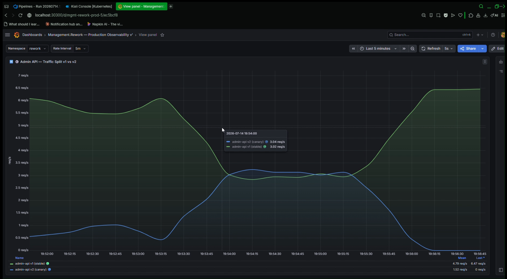

*Figure: Admin API canary deployment showing gradual traffic migration from v1 (stable) to v2 (canary)*

| Phase | v1 Traffic | v2 Traffic | Status |
|-------|------------|------------|--------|
| **Start** | ~6 req/s | 0 req/s | 🔵 100% v1 |
| **Canary (10%)** | ~5.4 req/s | ~0.6 req/s | 🟢 Testing |
| **Half (50%)** | ~3 req/s | ~3 req/s | 🟢 50/50 split |
| **Full** | 0 req/s | ~6 req/s | 🟢 100% v2 |

---

### 📊 Interactive HTML Chart

[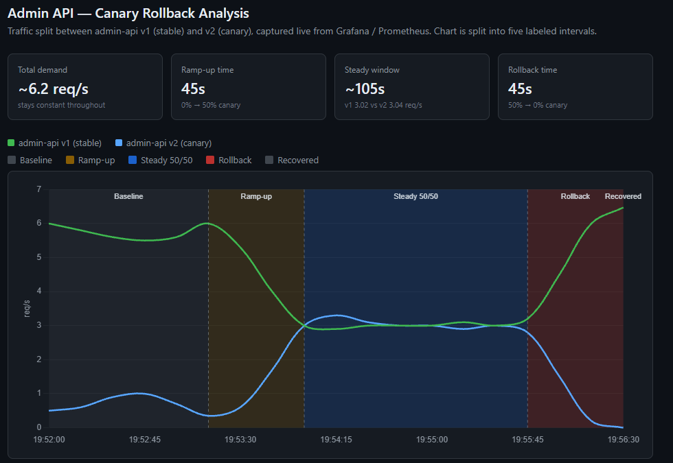](https://dali4833.github.io/management-Rework-PFE/docs/rollouts-metrics.html)

*Click the image to open the interactive chart in your browser*

---

**Timeline breakdown:**

| Interval | Time range | Duration | What's happening |
|----------|------------|----------|-------------------|
| 🔘 Baseline | 19:52:00 – 19:53:15 | 75s | v1 handles 100% of traffic, canary idle at near-zero |
| 🟠 Ramp-up | 19:53:15 – 19:54:00 | 45s | Controller shifts weight from v1 to v2, 0% → 50% |
| 🔵 Steady 50/50 | 19:54:00 – 19:55:45 | 105s | Split holds evenly (3.02 vs 3.04 req/s) while analysis runs |
| 🔴 Rollback | 19:55:45 – 19:56:30 | 45s | Analysis fails a check, controller reverts weight, 50% → 0% |
| 🔘 Recovered | 19:56:30 onward | — | v1 back to 100% of traffic, canary fully drained |

Total request volume stayed constant (~6.2 req/s) throughout — the pipeline shifted *routing weight*, not overall load, confirming the split was managed cleanly by the mesh rather than causing any user-facing disruption.

The canary's automated analysis step flagged a regression during the steady-state window and triggered a rollback, restoring 100% of traffic to the stable version with zero downtime. This demonstrates the full progressive-delivery loop working end-to-end: **deploy → analyze → detect → rollback**, without manual intervention.

---

## 👨‍💻 Author

**Mohamed Ali**

- 📧 Email: Mohamed Ali hamraoui 
- 🔗 LinkedIn: www.linkedin.com/in/mohamed-ali-hamraoui-303662255
- 🐙 GitHub: [dali4833](https://github.com/dali4833)

PFE Project 2025-2026

---

⭐ If you find this useful, please give it a star!
